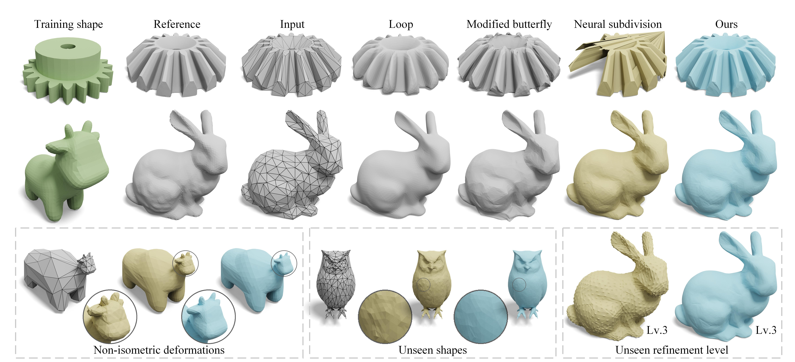

<div align="center">
    <h2> <a href="https://arxiv.org/abs/2405.20853">Neural Mesh Refinement (NMR)</a></h2>

<p align="center">
  <a href="https://zhuzhiwei99.github.io/NeuralMeshRefinement/">[Project Page]</a> 
  <a href="https://jzus.zju.edu.cn/iparticle.php?doi=10.1631/FITEE.2400344">[Paper]</a>
  <a href="#-citation">[Citation]
</p>

</div>


## 🏃 Intro of NMR


Neural Mesh Refinement (NMR) utilized a learned geometric prior on fine shapes to adaptively refine coarse meshes through subdivision, demonstrating robust generalization to unseen shapes, poses, and non-isometric deformation. It can also refine coarse non-organic shapes into finer ones with appropriate geometric details, even when trained on organic shapes. 


NMR does not suffer from the inherent limitations of existing methods, such as volume shrinkage and over-smoothing (Loop), amplification of tessellation artifacts (Modified Butterfly), or shape damage (Neural Subdivision). Moreover, it outperforms neural subdivision in generalization across non-isometric deformations, unseen shapes, and unseen refinement levels.


This is a prototype implementation in Python 3.8  with PyTorch 1.12.1.

## ⚡ Quick Start

### Installation

```bash
# Clone the repo.
git clone https://github.com/zhuzhiwei99/NeuralMeshRefinement.git
cd NeuralMeshRefinement
```

### Set up environment


```bash
# Make a conda environment
conda create -n nmr python==3.8
conda activate nmr
```
Please install [Pytorch](https://pytorch.org/get-started/previous-versions/) first. We have tested successfully in the following environment:
- Ubuntu 20.04 with NVIDIA GeForce RTX 3090: `pytorch==1.12.1 torchvision==0.13.1 torchaudio==0.12.1 cudatoolkit=11.3`
- Windows 10 without GPU: `pytorch==1.12.1`

Then, install the required packages:
```bash
# Install necessary Packages 
pip install -r requirments.txt
```

## 💻Test

For a quick demo, please use the pre-trained model and test on new shapes. To test the pre-trained model please run
```bash
python test.py -p ckpt/thingi10k_netparams.dat -t examples/coarse/sphere.obj -ns 3
```

Then, you will get refined meshes in  `examples/refined/thingi10k_netparams/`

You can also try other pre-trained models and coarse meshes.

### pre-trained models

- `ckpt/thingi10k_netparams.dat`: We trained this net using the [Thingi10k](https://ten-thousand-models.appspot.com/) dataset, which can adaptively refine the coarse mesh.
- `ckpt/bunny_netparams.dat`: We trained this net using the `examples/original/bunny.obj`, which tends to smoothly refine the coarse mesh.
- `ckpt/gear_netparams.dat`:  We trained this net using the `examples/original/gear.obj`, which tends to sharply refine the coarse mesh.

### coarse meshes

- `examples/coarse/sphere.obj`

- `examples/coarse/cube.obj`

You can also try other coarse manifold meshes, otherwise using [fTetWild](https://github.com/wildmeshing/fTetWild) to preprocess them.

 Want to see more results? Check our project page out [here](https://zhuzhiwei99.github.io/NeuralMeshRefinement/)!

## 📚 Dataset
- [TOSCA dataset](https://tosca.cs.technion.ac.il/book/resources_data.html)
- [Thingi10K dataset](https://ten-thousand-models.appspot.com/)
- [Stanford Bunny](http://graphics.stanford.edu/pub/3Dscanrep/bunny.tar.gz)

## 📖 Citation
If you find our work useful for your project, please consider citing the following paper.

### BibTeX

```bibtex
@article{zhu2025neural,
        title   = {Neural mesh refinement},
        author  = {ZHU, Zhiwei and GAO, Xiang and YU, Lu and LIAO, Yiyi},
        journal = {Frontiers of Information Technology \& Electronic Engineering},
        year    = {2025},
        volume  = {26},
        number  = {5},
        pages   = {695--712},
        doi     = {10.1631/FITEE.2400344}
}
```
### Plain Text

```Plain Text
Zhiwei ZHU, Xiang GAO, Lu YU, Yiyi LIAO, 2025. Neural mesh refinement. Frontiers of Information Technology & Electronic Engineering, 26(5):695-712. https://doi.org/10.1631/FITEE.2400344
```

## Contributors

This project is developed by [Zhiwei Zhu](zhuzhiwei99@zju.edu.cn), if you have any questions about this project, please feel free to contact me.

## Acknowledgement
We express our genuine thanks to the amazing work: [Neural Subdivision](https://github.com/HTDerekLiu/neuralSubdiv), [fTetWild](https://github.com/wildmeshing/fTetWild).